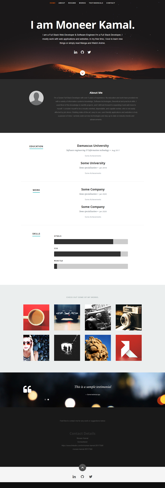

A simple SPA Portfolio template for developer/designers built with React. Use it to showcase your work, testimonials and other information to clients. 

(trining on react js) this is the source code of react watch project the basic idea is taken from 

(http://hits.dwyl.io/rbhatia46/React-Portfolio.svg)](http://hits.dwyl.io/rbhatia46/React-Portfolio)

the project contain three main component togather they output a digital watch with the choice to view or hide the current date

Preview:


## How to use
1. Clone/Download the repo.
2. Run  ``` npm install ```.
3. Change the values in ```src/resumeData.js``` to suit your use-case.
4. Run ```npm start``` to spin the up the local dev server port 3000.(http://localhost:3000).
5. Make required changes in ```src/resumeData.js``` to suit your needs.


